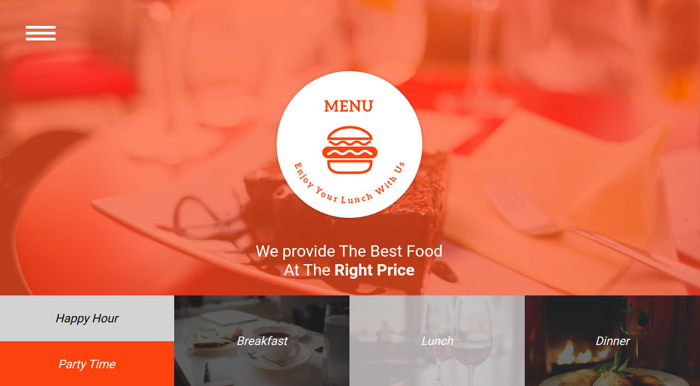

# Anita's Kitchen

**Author:** Densel Esekon

## Introduction
Welcome to Anita's Kitchen website! This project showcases a modern and engaging website for Anita's Kitchen. The website aims to provide visitors with an immersive experience of the restaurant's menu, special offers, and more.

## Features
- **Navigation:** Easily navigate through different sections of the website using the intuitive navigation menu.
- **Logo and Tagline:** The restaurant's logo and a catchy tagline to entice visitors.
- **Special Offers:** Highlighting special deals and promotions.
- **Menu Sections:** Sections for Breakfast, Lunch, and Dinner to explore the diverse menu items.
- **Fast Food:** Information about delicious fast food offerings.
- **Drinks:** Details about the restaurant's drinks menu.
- **Client Reviews:** Happy customer reviews to build trust.
- **About Menu:** Information about the restaurant and its team.
- **Contact:** A dedicated section for users to get in touch with the restaurant.
- **Footer:** Provides essential information about the restaurant and social media links.

## Installation
1. Clone this repository: `https://github.com/esekon/anita-kitchen.git`
2. Navigate to the project directory: `cd anita-kitchen`
3. Open the `index.html` file in your preferred web browser to experience the website.

## Usage
Visit the live website [here](https://esekon.github.io/anita-kitchen/) to explore Anita's Kitchen.

## Technologies Used
- HTML5 and CSS for structuring and styling the website.
- Google Fonts for typography.
- GitHub Pages for hosting the live website.

## Contact
For any inquiries, suggestions, or collaboration opportunities, feel free to contact the author:
- **Name:** Densel Esekon
- **Email:** esekondensel@gmail.com

## Website Link
Find the live website at: [Anita's Kitchen](https://esekon.github.io/anita-kitchen/)

## Copyright and License
This project is licensed under the [MIT License](LICENSE).

---

© 2016 Menu Restaurant
